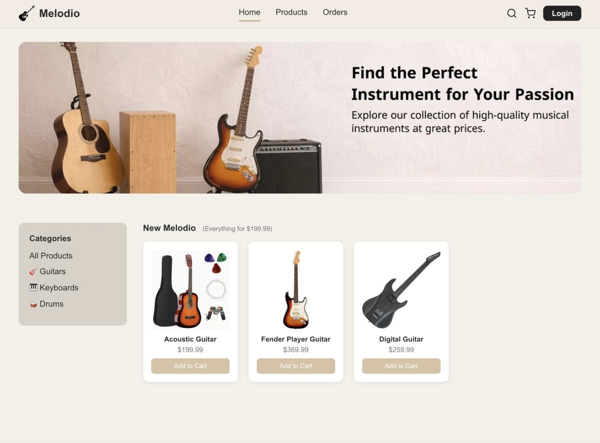
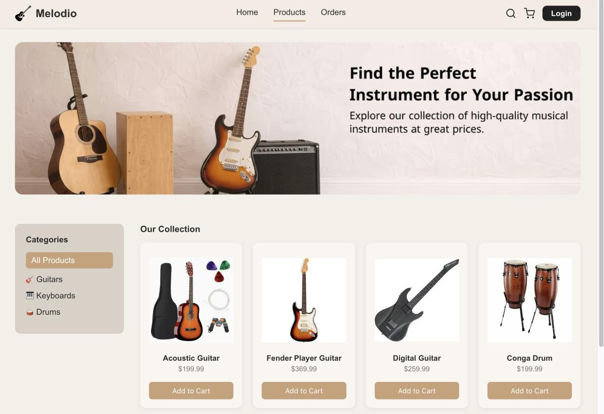
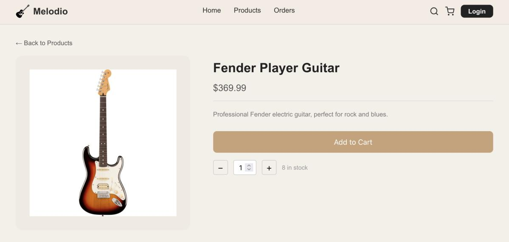

# Melodio

### Online Musical Instruments Store

Melodio is a web application for browsing musical instruments, managing a shopping cart, placing cash-on-delivery orders, and viewing order history. It includes interfaces for customers, administrators, and delivery personnel.

Its PHP implementation separates presentation pages, business classes, and database access classes to organize the shopping workflow into distinct responsibilities.

## Project Goal

Provide a musical instrument shopping workflow while applying layered architecture, database stored procedures, form validation, and transaction-based order processing.

## Features

- Product catalog with guitar, keyboard, and drum categories.
- Product detail pages showing descriptions, prices, images, and stock availability.
- Customer registration and login, with role-based navigation.
- Session-based cart with quantity updates and item removal confirmation.
- Cash-on-delivery checkout with a contact phone number.
- Order history with item quantities, purchase prices, and totals.
- Administrator dashboard displaying order counts, customer counts, and revenue from delivered orders.
- Administrator and delivery interfaces for updating order status.
- JavaScript form validation and server-side checks in business classes.
- Order creation, item insertion, and stock updates coordinated within a database transaction.

## Screenshots

Explore the home page, product catalog, and product details below.

### Home



### Product Catalog



### Product Details



## Technologies and Tools

| Technology / tool | Use |
| --- | --- |
| PHP | Server-rendered pages and application classes |
| HTML and CSS | Page structure and visual styling |
| JavaScript | Form validation and interface interactions |
| MariaDB / MySQL-compatible SQL | Relational database and stored procedures |
| MySQLi with mysqlnd | Database connections, prepared procedure calls, and result fetching |
| PHP sessions | Login state and shopping cart |
| phpMyAdmin | Source database export |

The supplied SQL export records MariaDB **10.4.28** and PHP **8.2.4**. The code uses PHP 8 syntax, including `match`.

## Project Structure

| Location | Responsibility |
| --- | --- |
| Root PHP pages | Presentation: home, products, authentication, cart, orders, and dashboard |
| `business/` | `UserBL`, `ProductBL`, and `OrderBL`: validation and application operations |
| `dal/` | `Database`, `User`, `Product`, `Order`, and `OrderItem`: database access |
| `DB/melodiop3.sql` | Tables, constraints, stored procedures, and product seed data |
| `config/database.example.php` | Database configuration template without credentials |
| `assets/` | CSS, JavaScript, logo, banner, and product images |
| `docs/screenshots/` | Selected screenshots from the supplied report |

Typical request flow: PHP page → business class → data access class → database stored procedure.

## Local Setup

### Requirements

- PHP 8 or later with `mysqli` and `mysqlnd` enabled. PHP 8.2 corresponds to the source export.
- MariaDB with stored procedure support. The source export was produced by MariaDB 10.4.28; the prepared schema was also successfully imported into MariaDB 10.11.14 during review.
- A PHP-capable local web server, such as Apache in a local development stack.
- Permission to create tables and stored procedures in a local database.

### 1. Place the application in the web root

Copy this repository's contents into a directory named **`melodio`** in your web server's document root, for example `htdocs/melodio`.

The application uses absolute `/melodio/...` URLs. Keep this directory name unless you intentionally update those paths.

### 2. Import the database

Create an empty database named `melodiop3` using the `utf8mb4` character set, select it in phpMyAdmin, and import `DB/melodiop3.sql`.

Alternatively, after creating that database, import from a terminal:

```bash
mysql -u YOUR_LOCAL_DB_USER -p melodiop3 < DB/melodiop3.sql
```

The SQL file includes the schema, stored procedures, and five product records. Import it into an empty database to initialize the application.

### 3. Configure the database connection

Copy `config/database.example.php` to `config/database.php`. Enter your local database host, database name, username, and password in that file.

`config/database.php` is excluded by `.gitignore`. Keep local credentials out of version control.

### 4. Start and open the application

Start your local database and web server, then open:

```text
http://localhost/melodio/index.php
```

Create a new customer account using the Sign Up page.

For a local administrator or delivery demonstration, register a separate account and manually change only that account's `role` in the local `users` table to `admin` or `delivery`.

## Verification

The project passed PHP lint checks for all 20 PHP files and a JavaScript syntax check. Local file references and database stored procedure names were also checked.

On **PHP 8.3.6 and MariaDB 10.11.14**, **24 backend integration checks passed**, covering:

- Customer registration, hashed password verification, and duplicate email validation.
- Cart validation and product stock checks.
- Order creation, item records, totals, and customer order history.
- Stock updates and role restrictions on order status changes.
- Transaction rollback after a stock update failure.
